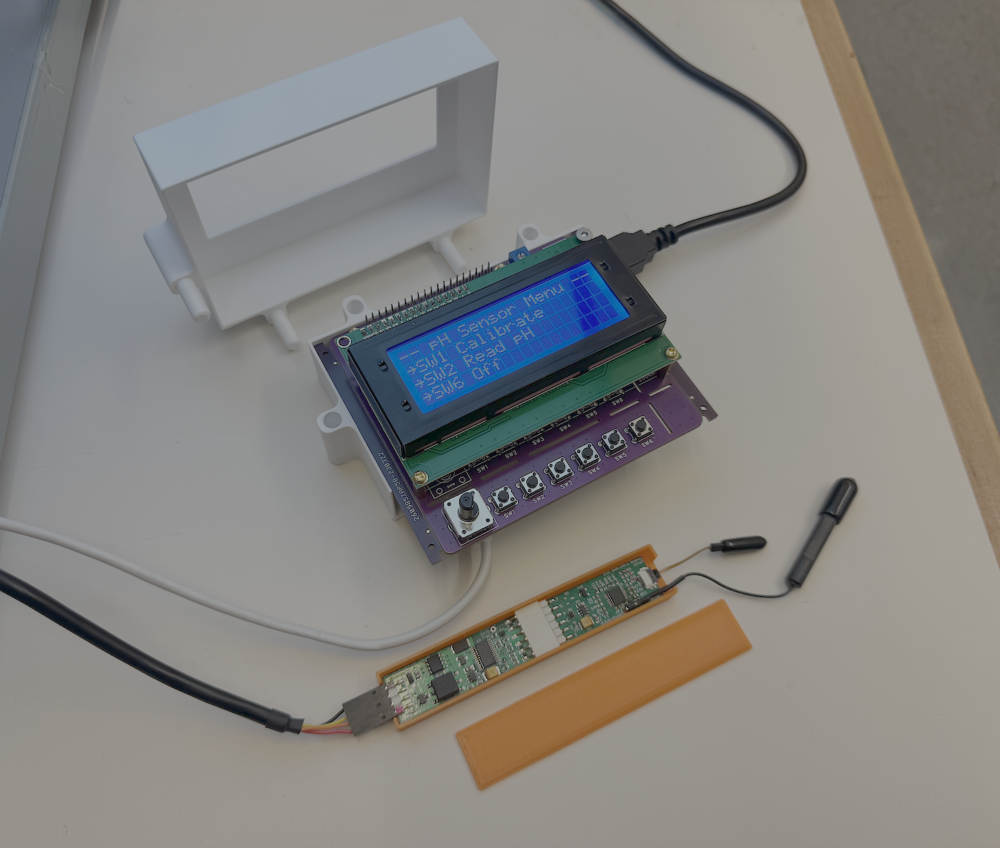
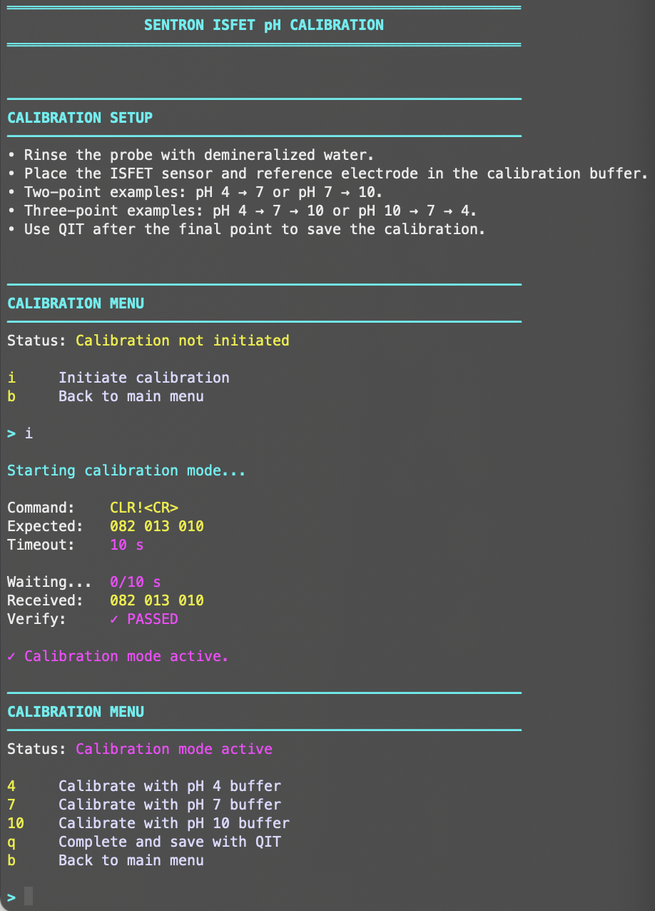

# Sentron ISFET pH Evaluation Kit Raspberry Pi Interface

## Overview

This repository contains software, hardware designs, and supporting documentation for interfacing the Sentron ISFET pH Evaluation Kit with a Raspberry Pi 5.

The project includes a terminal-based interface for calibration and measurement, an LCD-based user interface, protocol decoding for pH, temperature, and calibration slope retrieval, and supporting enclosure designs. 

## Screenshots

### Complete System

*Complete Raspberry Pi 5 interface consisting of the Sentron ISFET Evaluation Kit, Raspberry Pi 5, custom 3D-printed enclosures, LCD display, and rotary encoder.*

### Terminal Interface

*Interactive terminal interface*

## Features

* Serial communication with the Sentron ISFET pH Evaluation Kit
* Multi-point pH calibration 
* Real-time pH measurement
* Temperature measurement
* Calibration slope retrieval and decoding
* Terminal-based user interface
* LCD-based user interface with rotary encoder navigation
* Embedded Raspberry Pi 5 operation
* Supporting enclosure and mounting hardware designs

## Hardware

* Raspberry Pi 5
* Sentron R&D pH Evaluation Kit
  * Analog Front-End
  * AD Converter
  * ISFET pH Sensor
  * Reference Electrode
  * USB Interface
* Sequent Microsystems Six-in-One LCD Adapter Kit (2004 or 1602 LCD Display)

---

## Repository Contents

### `code/sentron_interface.py`

Combined terminal interface providing:

* Multi-point calibration
* Continuous pH and temperature readout
* Calibration slope retrieval
* Interactive terminal menus for switching between calibration and measurement modes

### `code/lcd_interface.py`

LCD-based interface featuring rotary encoder navigation, guided calibration workflows, and real-time pH and temperature display.

### docs/

Supporting documentation, setup instructions, hardware references, and project photos.

### stl/

3D-printable enclosures and mounting components.

---

## Future Work

* Characterization curves for ionic strength effects on pH readings
* CSV data logging and export
* Measurement history and trend visualization
* Additional ISFET sensor characterization tools

## Notes

This repository provides a companion software interface for the Sentron ISFET pH Evaluation Kit.

The implementation is based on the communication protocol and documentation supplied with the Sentron Evaluation Kit.
